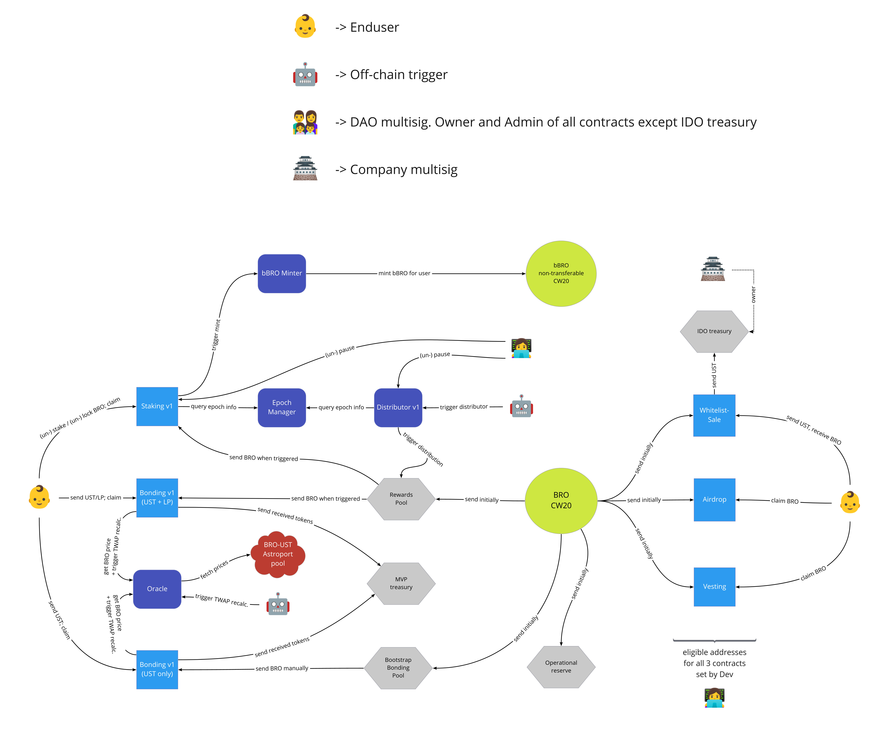

[](https://github.com/block42-blockchain-company/brotocol-token-contracts/actions/workflows/basic.yml)
[](https://github.com/block42-blockchain-company/brotocol-token-contracts/actions/workflows/audit.yml)

---

# Brokkr Protocol ("Brotocol") Core Contracts

All contracts related to the BRO token.
If you're looking for the strategy contracts, check out this [repo](https://github.com/block42-blockchain-company/brotocol-strategies).

In case you have improvement ideas or questions, you can reach us via [discord](https://discord.com/invite/CDNKYTDqTE),
or open an issue in this repository.

## Architecture Diagram



## Contracts

| Name                                                       | Description                                   |
| ---------------------------------------------------------- | --------------------------------------------- |
| [`airdrop`](contracts/airdrop)                             | Eligible wallets can claim BRO                |
| [`bbro-minter`](contracts/bbro-minter)                     | Contract can mint/burn bBRO                   |
| [`bbro-token`](contracts/bbro-token)                       | Non-transferable CW20 token                   |
| [`bonding-v1`](contracts/bonding-v1)                       | Send UST/LP token, claim discounted BRO       |
| [`distributor-v1`](contracts/distributor-v1)               | Transfers BRO from the rewards pool to bonding and staking |
| [`epoch-manager`](contracts/epoch-manager)                 | Stores global information needed for multiple contracts |
| [`mvp-treasury`](contracts/mvp-treasury)                   | Holds any funds                               |
| [`oracle`](contracts/oracle)                               | TWAP oracles for bonding                      |
| [`rewards`](contracts/rewards)                             | Holds BRO used for bonding and staking rewards|
| [`staking-v1`](contracts/staking-v1)                       | Stake BRO, claim BRO and bBRO                 |
| [`token-pool`](contracts/token-pool)                       | Holds BRO only                                |
| [`vesting`](contracts/vesting)                             | Eligible wallets can claim BRO according to the schedules |
| [`whitelist-sale`](contracts/whitelist-sale)               | Eligible wallet can purchase BRO at a fixed price |

For the BRO token, we instantiate a default CW20 contract.


## Testing

Run unit tests via 
```
cargo test
```

## How to build
Compile the contracts to wasm files with
```
./build_release.sh
```

Build the schema json files with
```
./scripts/build_schema.sh
```

### For **deployment** please follow this [`README`](scripts/deploy)


## Docs
Generate docs by running:
```
cargo doc --no-deps
```

## Github Pipelines
- basic.yml - runs unit tests(cargo test) and linter commands (cargo fmt, cargo clippy)
- codecov.yml - runs cargo tool which checks current code coverage via implemented unit tests
- audit.yml - audit Cargo.lock files for crates with security vulnerabilities reported to the RustSec Advisory Database.

